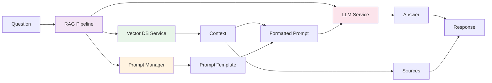
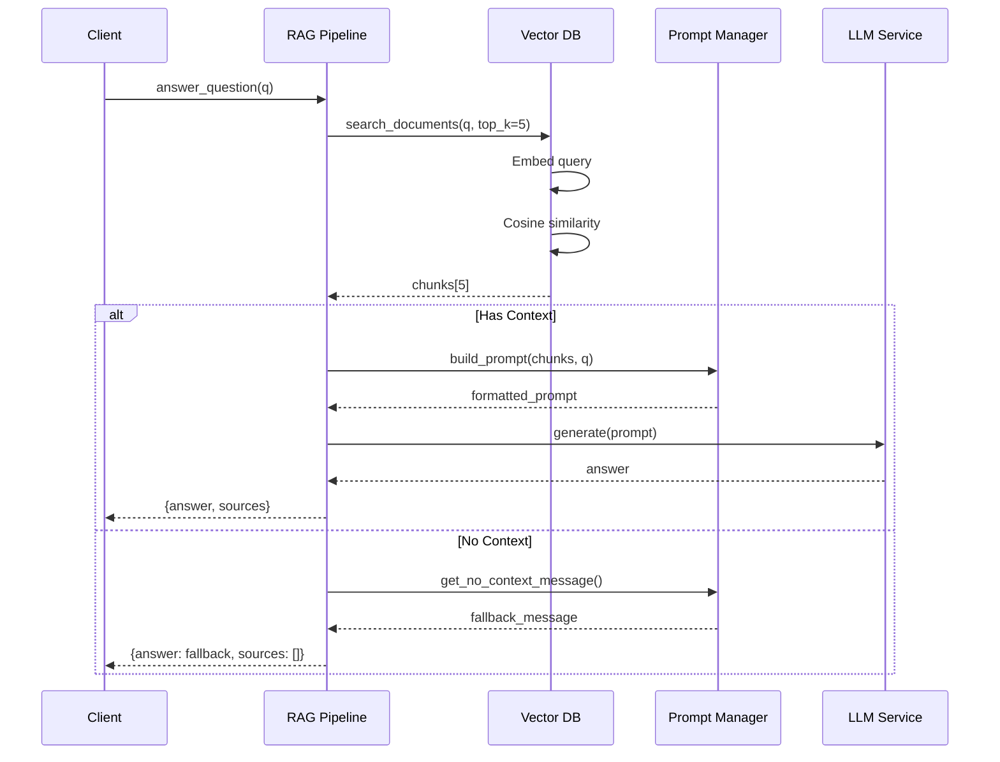
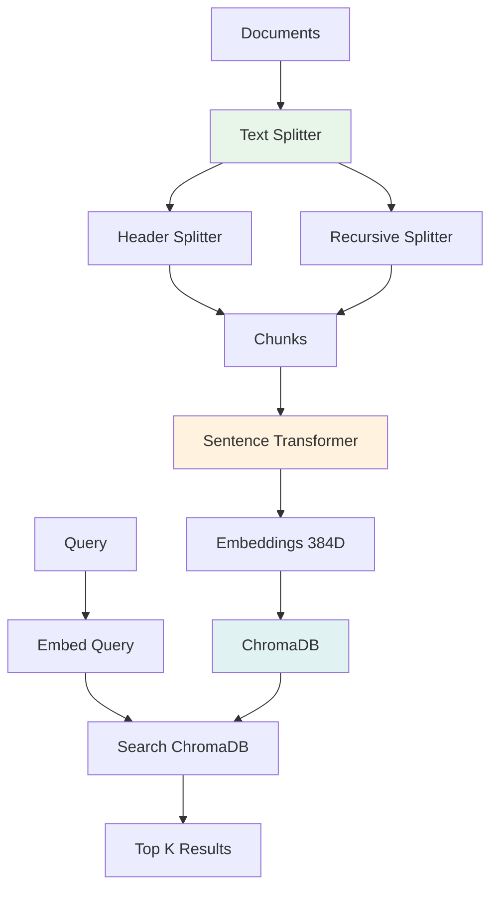
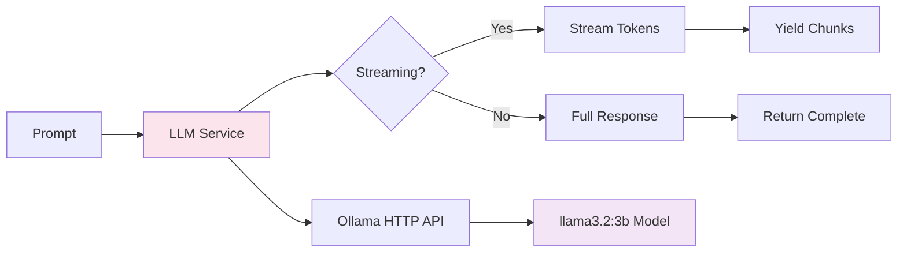
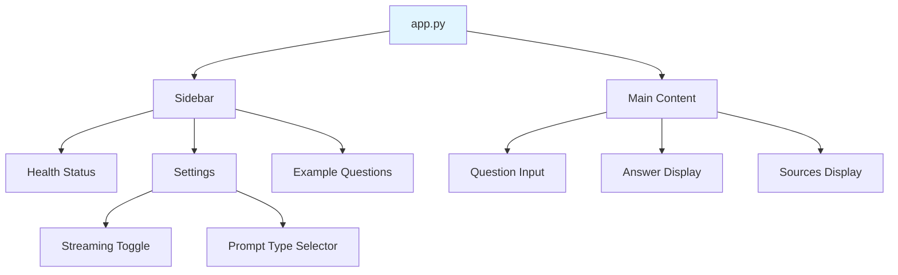
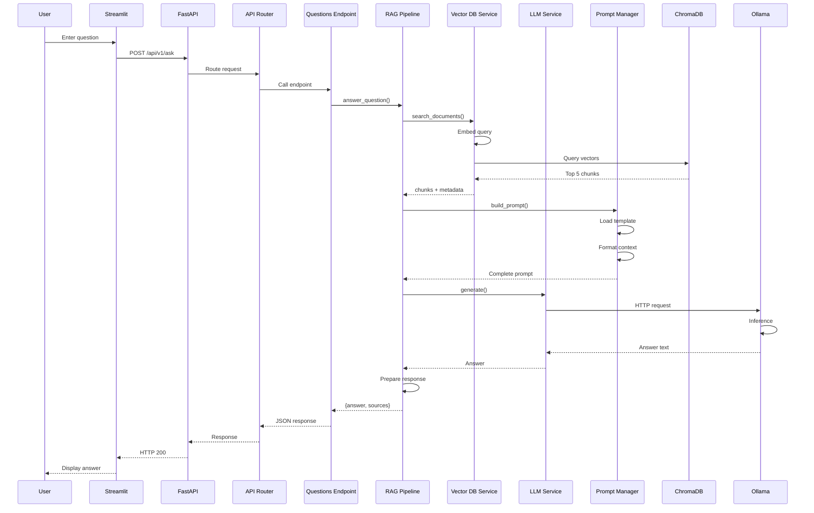

# Component Details

This document provides detailed information about each component in the RAG system.

## Service Layer Components

### RAG Pipeline

**File**: [backend/app/services/rag_pipeline.py](../../backend/app/services/rag_pipeline.py)

**Responsibility**: Orchestrates the entire RAG (Retrieval-Augmented Generation) process.

#### Architecture



#### Key Methods

```python
class RAGPipeline:
    def answer_question(
        self, 
        question: str
    ) -> Dict[str, Any]:
        """
        Synchronous question answering.
        
        Returns:
            {
                "answer": str,
                "sources": List[Dict],
                "metadata": Dict
            }
        """
```

```python
    async def answer_question_stream(
        self, 
        question: str
    ) -> AsyncGenerator[str, None]:
        """
        Asynchronous streaming generation.
        
        Yields:
            Answer tokens one by one
        """
```

#### Flow Diagram



---

### Vector DB Service

**File**: [backend/app/services/vector_db.py](../../backend/app/services/vector_db.py)

**Responsibility**: Document indexing, embedding, and semantic search.

#### Architecture



#### Chunking Strategy

```python
# 1. Header-based splitting (preserves structure)
MarkdownHeaderTextSplitter(
    headers_to_split_on=[
        ("#", "Header 1"),      # Main sections
        ("##", "Header 2"),     # Subsections
        ("###", "Header 3"),    # Details
    ]
)

# 2. Recursive splitting (handles overflow)
RecursiveCharacterTextSplitter(
    chunk_size=800,           # Target size
    chunk_overlap=200,        # Context preservation
    separators=["\n\n", "\n", ". ", " ", ""]
)
```

**Example**:

Input:
```markdown
# Benefits

## Health Insurance
We offer comprehensive health insurance...

### Dental Coverage
Dental is included...
```

Output Chunks:
```python
[
    {
        "text": "Health Insurance\nWe offer comprehensive...",
        "metadata": {
            "Header 1": "Benefits",
            "Header 2": "Health Insurance"
        }
    },
    {
        "text": "Dental Coverage\nDental is included...",
        "metadata": {
            "Header 1": "Benefits",
            "Header 2": "Health Insurance",
            "Header 3": "Dental Coverage"
        }
    }
]
```

#### Key Methods

```python
def index_directory(self, directory_path: str) -> int:
    """Index all .md files in directory"""
    
def search_documents(
    self, 
    query: str, 
    top_k: int = 5
) -> List[Dict[str, Any]]:
    """Semantic search"""
    
def _chunk_document_by_headers(
    self, 
    content: str
) -> List[str]:
    """Smart chunking with header preservation"""
```

---

### LLM Service

**File**: [backend/app/services/llm_service.py](../../backend/app/services/llm_service.py)

**Responsibility**: Interaction with Ollama for answer generation.

#### Architecture



#### Configuration

```python
class LLMService:
    def __init__(self):
        self.base_url = "http://localhost:11434"
        self.model = "llama3.2:3b"
        self.temperature = 0.3      # Low for factual
        self.top_p = 0.9
        self.max_tokens = 1000
```

#### Methods

```python
def generate(
    self, 
    prompt: str, 
    temperature: float = 0.3
) -> str:
    """
    Synchronous generation.
    
    POST /api/generate
    {
        "model": "llama3.2:3b",
        "prompt": "...",
        "stream": false
    }
    """

async def generate_stream(
    self, 
    prompt: str
) -> AsyncGenerator[str, None]:
    """
    Asynchronous token streaming.
    
    POST /api/generate
    {
        "model": "llama3.2:3b",
        "prompt": "...",
        "stream": true
    }
    
    Response: NDJSON stream
    """
```

---

### Prompt Manager

**File**: [backend/app/core/prompt_manager.py](../../backend/app/core/prompt_manager.py)

**Responsibility**: Centralized prompt template management.

#### Template Structure

```yaml
# prompts.yaml
system_prompts:
  default:
    name: "Default Assistant"
    content: |
      You are an AI assistant specialized in answering questions
      about the Basecamp Employee Handbook...
  
  friendly:
    name: "Friendly Colleague"
    content: |
      You are a helpful colleague at Basecamp...
  
  concise:
    name: "Concise Expert"
    content: |
      Provide brief, direct answers...

rag_templates:
  with_context: |
    Context from handbook:
    {context}
    
    Question: {question}
    
    Answer based on the context above:
  
  no_context: |
    I couldn't find specific information about "{question}"
    in the handbook...
```

#### Usage

```python
pm = PromptManager()

# Build complete prompt
prompt = pm.build_prompt(
    question="What is vacation policy?",
    context_chunks=[chunk1, chunk2]
)

# Format context
formatted = pm.format_context(chunks)

# Get fallback message
fallback = pm.get_no_context_message("vacation")
```

---

## API Layer Components

### Endpoints

#### Health Endpoint

**File**: [backend/app/api/endpoints/health.py](../../backend/app/api/endpoints/health.py)

```python
@router.get("/health")
async def health_check() -> Dict[str, Any]:
    """
    System health status.
    
    Returns:
        {
            "status": "healthy",
            "version": "2.0.0",
            "ollama_available": true,
            "documents_indexed": 150
        }
    """
```

#### Questions Endpoint

**File**: [backend/app/api/endpoints/questions.py](../../backend/app/api/endpoints/questions.py)

```python
@router.post("/ask")
async def ask_question(request: QuestionRequest):
    """
    Non-streaming question answering.
    
    Request:
        {
            "question": "What is vacation policy?"
        }
    
    Response:
        {
            "answer": "Basecamp offers...",
            "sources": [
                {
                    "text": "...",
                    "metadata": {...},
                    "score": 0.92
                }
            ]
        }
    """

@router.post("/ask/stream")
async def ask_question_stream(request: QuestionRequest):
    """
    Streaming question answering.
    
    Response: Server-Sent Events (SSE)
    
    data: Basecamp
    data:  offers
    data:  unlimited
    data:  vacation...
    """
```

---

## Data Layer Components

### Database Connection

**File**: [backend/app/database/connection.py](../../backend/app/database/connection.py)

**Pattern**: Singleton

```python
class ChromaDBConnection:
    _instance = None
    
    def __new__(cls):
        if cls._instance is None:
            cls._instance = super().__new__(cls)
            cls._instance._initialize()
        return cls._instance
    
    def get_collection(self, name: str):
        """Get or create collection"""
    
    def reset_collection(self, name: str):
        """Delete and recreate collection"""
```

**Why Singleton?**
- ChromaDB client should be shared
- Avoid multiple connections
- Connection pooling
- Resource efficiency

---

## Core Components

### Configuration

**File**: [backend/app/core/config.py](../../backend/app/core/config.py)

```python
class Settings(BaseSettings):
    # API
    app_name: str = "Basecamp RAG API"
    version: str = "2.0.0"
    port: int = 8000
    
    # Ollama
    ollama_base_url: str = "http://localhost:11434"
    ollama_model: str = "llama3.2:3b"
    
    # ChromaDB
    chroma_persist_directory: str = "../data/chroma_db"
    collection_name: str = "basecamp_handbook"
    
    # RAG
    chunk_size: int = 800
    chunk_overlap: int = 200
    top_k_results: int = 5
    temperature: float = 0.3
    
    # Documents
    documents_directory: str = "../knowledge_base"
    
    # Logging
    log_level: str = "INFO"
    
    class Config:
        env_file = ".env"
```

### Logging

**File**: [backend/app/core/logging.py](../../backend/app/core/logging.py)

#### Features

- **JSON Formatting**: Structured logs
- **File Rotation**: Max 10MB per file, 5 backups
- **Context Injection**: Add request IDs
- **Multiple Handlers**: Console + File

```python
setup_logging()

logger = logging.getLogger(__name__)
logger.info(
    "Document indexed",
    extra={
        "document": "benefits.md",
        "chunks": 15,
        "duration_ms": 234
    }
)
```

**Output**:
```json
{
    "timestamp": "2026-01-20T10:30:45.123Z",
    "level": "INFO",
    "logger": "app.services.vector_db",
    "message": "Document indexed",
    "document": "benefits.md",
    "chunks": 15,
    "duration_ms": 234
}
```

---

## Frontend Components

### Streamlit App

**File**: [frontend/app.py](../../frontend/app.py)

#### Structure



#### Key Features

```python
# Health check
def check_health():
    response = requests.get("http://localhost:8000/api/v1/health")
    return response.json()

# Non-streaming
def ask_question(question):
    response = requests.post(
        "http://localhost:8000/api/v1/ask",
        json={"question": question}
    )
    return response.json()

# Streaming
def ask_question_stream(question):
    response = requests.post(
        "http://localhost:8000/api/v1/ask/stream",
        json={"question": question},
        stream=True
    )
    
    placeholder = st.empty()
    full_answer = ""
    
    for line in response.iter_lines():
        if line:
            token = line.decode('utf-8').replace('data: ', '')
            full_answer += token
            placeholder.markdown(full_answer)
```

---

## Testing Components

### Test Structure

```
backend/tests/
├── unit/
│   ├── test_text_processing.py      # Utility functions
│   ├── test_config.py                # Configuration
│   └── test_prompt_manager.py        # Prompt templates
├── integration/
│   └── test_api_integration.py       # API endpoints
├── functional/
│   └── test_e2e.py                   # End-to-end flows
└── conftest.py                        # Shared fixtures
```

### Test Categories

```python
# Unit tests (fast, isolated)
@pytest.mark.unit
def test_clean_text():
    assert clean_text("  hello  ") == "hello"

# Integration tests (with mocks)
@pytest.mark.integration
def test_ask_endpoint(client, mock_rag):
    response = client.post("/api/v1/ask", json={"question": "test"})
    assert response.status_code == 200

# Functional tests (full system)
@pytest.mark.functional
def test_complete_rag_flow():
    # Real services, real DB
    pipeline = RAGPipeline(...)
    result = pipeline.answer_question("What is vacation policy?")
    assert "vacation" in result["answer"].lower()
```

---

## Component Interactions

### Complete Request Flow



---

## Performance Optimization

### Caching Strategy

```python
# Example: Cache embeddings
from functools import lru_cache

@lru_cache(maxsize=1000)
def embed_text(text: str) -> List[float]:
    return model.encode(text)
```

### Batch Processing

```python
# Index multiple documents efficiently
def index_directory(self, directory_path: str):
    files = list(Path(directory_path).glob("*.md"))
    
    # Process in batches
    batch_size = 10
    for i in range(0, len(files), batch_size):
        batch = files[i:i + batch_size]
        self._index_batch(batch)
```

---

## Next Steps

- [Data Flow Details](data-flow.md) - Detailed sequence diagrams
- [API Reference](../api/endpoints.md) - Complete API documentation
- [Development Guide](../development/setup.md) - Set up dev environment

---

**Component Checklist**:

- [x] RAG Pipeline - Orchestration
- [x] Vector DB Service - Search & Index
- [x] LLM Service - Answer Generation
- [x] Prompt Manager - Template Engine
- [x] API Endpoints - Request Handling
- [x] Frontend - User Interface
- [x] Logging - Observability
- [x] Configuration - Settings Management
- [x] Testing - Quality Assurance
