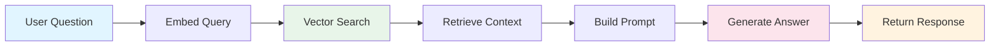
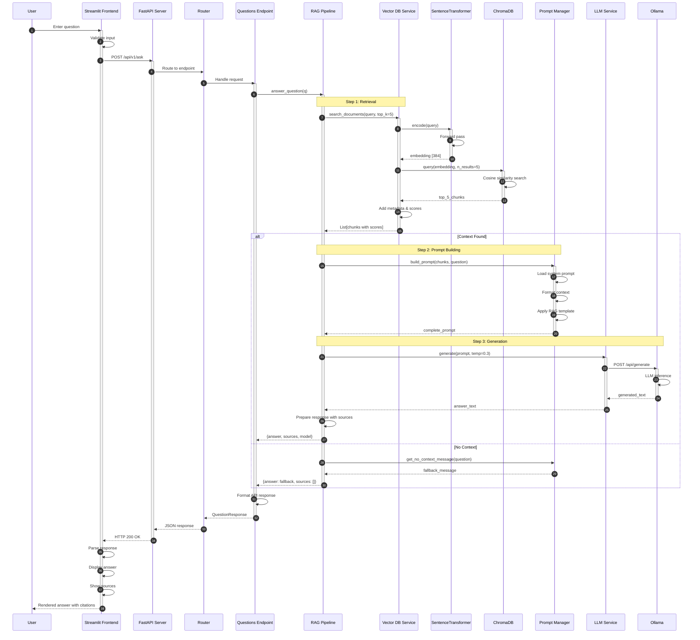
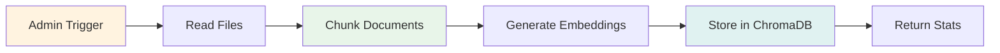
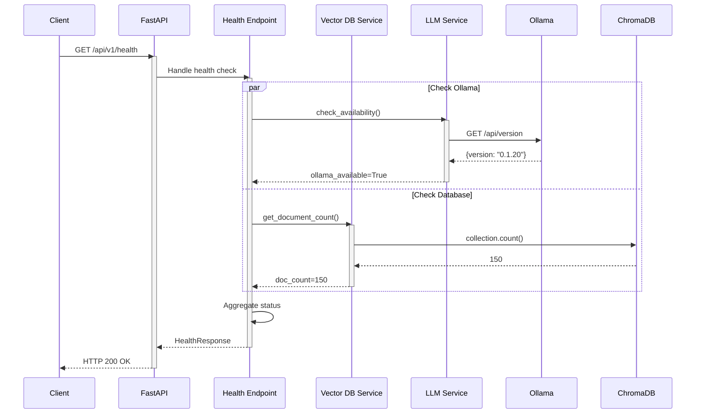
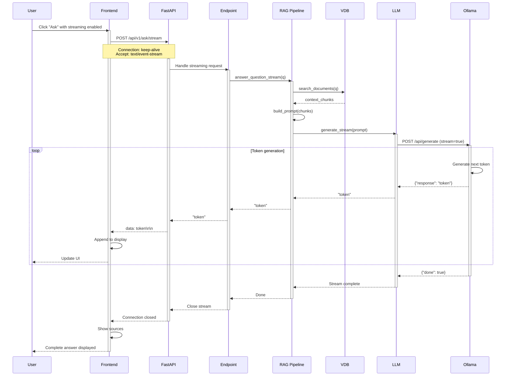
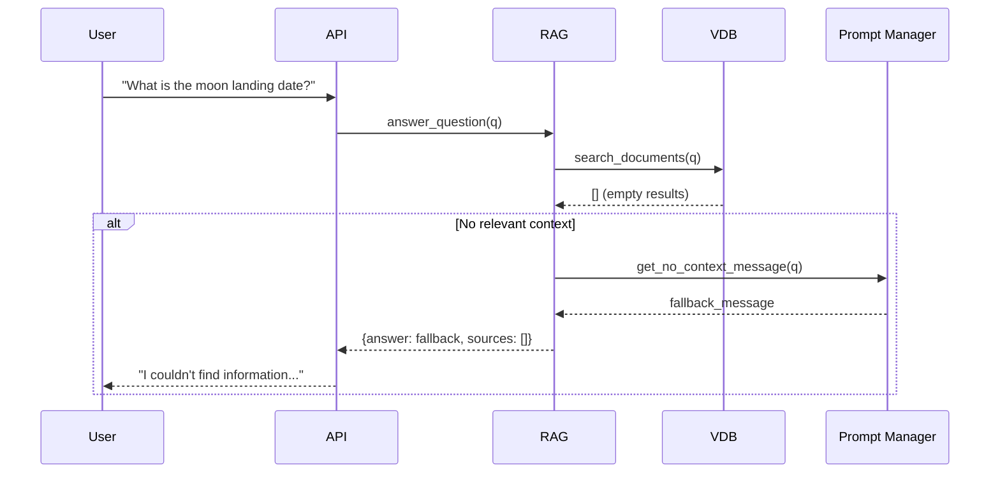
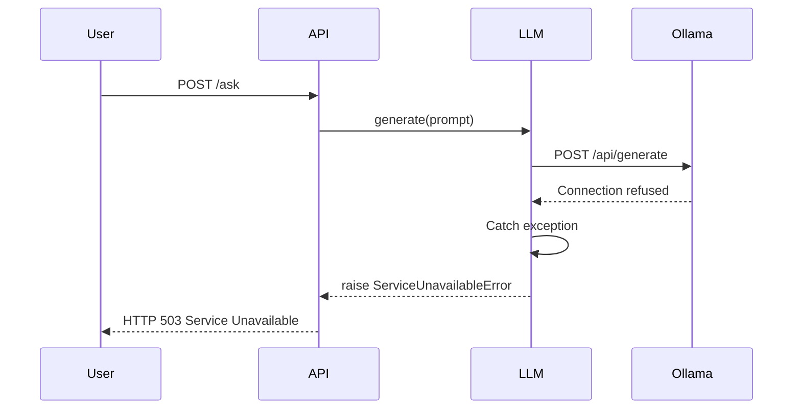
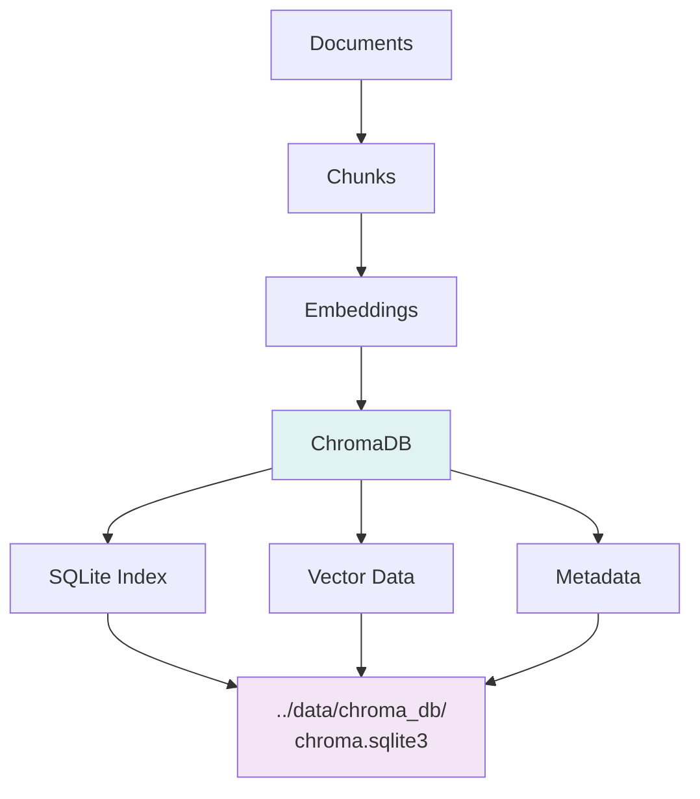

# Data Flow

This document details the data flow through the RAG system with comprehensive sequence diagrams.

## Overview

The system has four primary data flows:

1. **Question Answering** - User asks a question
2. **Document Indexing** - Admin reindexes knowledge base
3. **Health Monitoring** - System status checks
4. **Streaming Responses** - Real-time answer generation

---

## 1. Question Answering Flow

### High-Level Flow



### Detailed Sequence



### Data Transformations

#### 1. Query Embedding

```python
Input: "What is Basecamp's vacation policy?"

# Tokenization
tokens = ["what", "is", "basecamp", "'s", "vacation", "policy", "?"]

# Encoding (sentence-transformers)
embedding = model.encode(query)
# Output: [0.023, -0.156, 0.891, ..., -0.034]  # 384 dimensions
```

#### 2. Vector Search

```python
# Cosine similarity
for doc_embedding in database:
    similarity = cosine_similarity(query_embedding, doc_embedding)

# Top-K selection
top_5 = sorted(similarities, reverse=True)[:5]

# Example results:
[
    {
        "text": "Basecamp offers unlimited vacation...",
        "score": 0.92,
        "metadata": {"source": "benefits.md", "header": "Vacation Policy"}
    },
    {
        "text": "Time off should be coordinated with your team...",
        "score": 0.87,
        "metadata": {"source": "how-we-work.md", "header": "Taking Time Off"}
    },
    # ... 3 more
]
```

#### 3. Prompt Construction

```python
system_prompt = """
You are an AI assistant specialized in answering questions
about the Basecamp Employee Handbook.
"""

context = """
Context from handbook:

[1] Basecamp offers unlimited vacation...
Source: benefits.md (Score: 0.92)

[2] Time off should be coordinated with your team...
Source: how-we-work.md (Score: 0.87)

...
"""

rag_template = """
{context}

Question: {question}

Answer based on the context above:
"""

# Final prompt
final_prompt = system_prompt + "\n\n" + rag_template.format(
    context=context,
    question="What is Basecamp's vacation policy?"
)
```

#### 4. LLM Generation

```python
# Request to Ollama
{
    "model": "llama3.2:3b",
    "prompt": final_prompt,
    "temperature": 0.3,
    "stream": false
}

# Response
{
    "response": "Basecamp offers unlimited vacation time to all employees..."
}
```

---

## 2. Document Indexing Flow

### High-Level Flow



### Detailed Sequence

```mermaid
sequenceDiagram
    autonumber
    participant API as FastAPI
    participant VDB as Vector DB Service
    participant FS as File System
    participant Splitter as Text Splitter
    participant Embedder as SentenceTransformer
    participant ChromaDB
    participant DBConn as DB Connection
    
    Note over API,DBConn: Indexing happens at backend startup
    API->>VDB: index_directory(path)
    activate VDB
    
    VDB->>DBConn: reset_collection()
    activate DBConn
    DBConn->>ChromaDB: Delete collection
    ChromaDB-->>DBConn: OK
    DBConn->>ChromaDB: Create collection
    ChromaDB-->>DBConn: Collection created
    deactivate DBConn
    
    VDB->>FS: List *.md files
    FS-->>VDB: [file1.md, file2.md, ...]
    
    loop For each markdown file
        VDB->>FS: Read file content
        FS-->>VDB: content
        
        VDB->>Splitter: chunk_document_by_headers(content)
        activate Splitter
        
        Splitter->>Splitter: Split by headers (#, ##, ###)
        Splitter->>Splitter: Apply recursive splitting
        Splitter-->>VDB: chunks[]
        deactivate Splitter
        
        loop For each chunk
            VDB->>Embedder: encode(chunk_text)
            activate Embedder
            Embedder->>Embedder: Forward pass through model
            Embedder-->>VDB: embedding [384]
            deactivate Embedder
            
            VDB->>VDB: Prepare metadata
            Note over VDB: metadata = {<br/>  source: filename,<br/>  headers: {...},<br/>  chunk_id: N<br/>}
            
            VDB->>ChromaDB: add(chunk, embedding, metadata)
            ChromaDB->>ChromaDB: Store vector + metadata
            ChromaDB-->>VDB: OK
        end
    end
    
    VDB->>VDB: Count total chunks
    VDB-->>API: indexed_count
    deactivate VDB
    
    API->>API: Log indexing results
    Note over API: Ready to serve queries
    deactivate API
```

### Chunking Example

```python
# Input document
content = """
# Benefits

## Health Insurance

We offer comprehensive health insurance to all full-time employees.

### Medical Coverage
Medical coverage includes doctor visits, hospital stays...

### Dental Coverage
Dental coverage includes preventive care...

## 401(k) Plan

Basecamp matches 401(k) contributions up to 6%...
"""

# Step 1: Header-based split
header_chunks = [
    {
        "text": "We offer comprehensive health insurance...",
        "metadata": {
            "Header 1": "Benefits",
            "Header 2": "Health Insurance"
        }
    },
    {
        "text": "Medical coverage includes doctor visits...",
        "metadata": {
            "Header 1": "Benefits",
            "Header 2": "Health Insurance",
            "Header 3": "Medical Coverage"
        }
    },
    # ... more chunks
]

# Step 2: If any chunk > 800 chars, recursive split
# (maintains metadata from header split)

# Step 3: Generate embeddings
for chunk in header_chunks:
    embedding = embedder.encode(chunk["text"])
    chromadb.add(
        ids=[chunk_id],
        embeddings=[embedding],
        documents=[chunk["text"]],
        metadatas=[chunk["metadata"]]
    )
```

---

## 3. Health Check Flow

### Sequence Diagram



### Response Example

```json
{
    "status": "healthy",
    "version": "2.0.0",
    "timestamp": "2026-01-20T10:30:45.123Z",
    "ollama_available": true,
    "ollama_model": "llama3.2:3b",
    "documents_indexed": 150,
    "collections": ["basecamp_handbook"],
    "uptime_seconds": 3600
}
```

---

## 4. Streaming Response Flow

### Sequence Diagram



### Server-Sent Events Format

```http
HTTP/1.1 200 OK
Content-Type: text/event-stream
Cache-Control: no-cache
Connection: keep-alive

data: Basecamp

data:  offers

data:  unlimited

data:  vacation

data:  time

data:  to

data:  all

data:  employees

data: .

[DONE]
```

---

## Error Handling Flows

### No Context Found



### Ollama Unavailable



---

## Performance Metrics

### Typical Latencies

```mermaid
gantt
    title Question Answering Latency Breakdown
    dateFormat X
    axisFormat %L ms
    
    section Processing
    Query Embedding           :0, 30
    Vector Search            :30, 50
    Prompt Building          :50, 55
    LLM Generation (first token) :55, 500
    LLM Generation (complete)    :500, 3000
    Response Formatting      :3000, 3010
```



| Stage | Duration | % of Total |
|-------|----------|------------|
| **Embedding** | 30ms | 1% |
| **Vector Search** | 20ms | 0.7% |
| **Prompt Building** | 5ms | 0.2% |
| **LLM (First Token)** | 445ms | 14.8% |
| **LLM (Complete)** | 2500ms | 83.3% |
| **Total** | ~3000ms | 100% |

### Optimization Opportunities

1. **Caching**: Cache embeddings for frequent queries → Save 30ms
2. **Batch Processing**: Index multiple docs simultaneously → 3x faster indexing
3. **GPU Acceleration**: Use CUDA for Ollama → 2-5x faster generation
4. **Model Selection**: Use smaller model (7B vs 8B) → 20% faster

---

## Data Persistence

### ChromaDB Storage



**Directory Structure**:
```
data/
└── chroma_db/
    ├── chroma.sqlite3          # Metadata index
    ├── 00000000-0000-0000-0000-000000000000/
    │   └── data_level0.bin     # Vector data
    └── chroma.log              # Operation log
```

---

## Next Steps

- [Component Details](components.md) - Deep dive into each component
- [API Examples](../api/examples.md) - API usage examples
- [Architecture Overview](overview.md) - High-level system design

---

**Data Flow Summary**:

✅ **Question Answering**: User query → Embed → Search → Prompt → Generate → Response  
✅ **Indexing**: Files → Chunk → Embed → Store → Confirm  
✅ **Health**: Check Ollama + DB → Aggregate → Report  
✅ **Streaming**: Query → Search → Stream tokens → Complete  
✅ **Error Handling**: Graceful degradation with fallbacks
