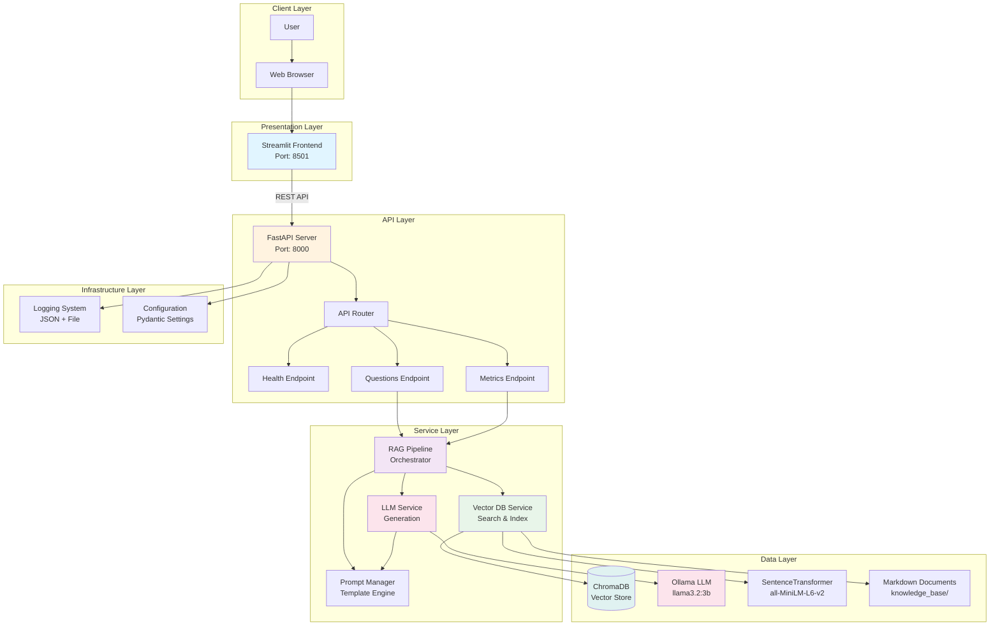
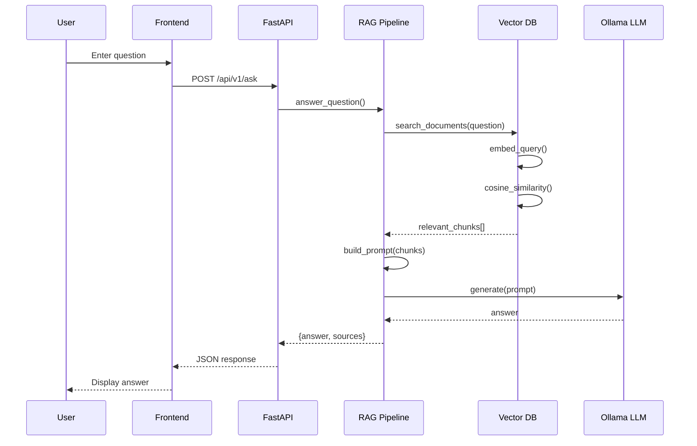
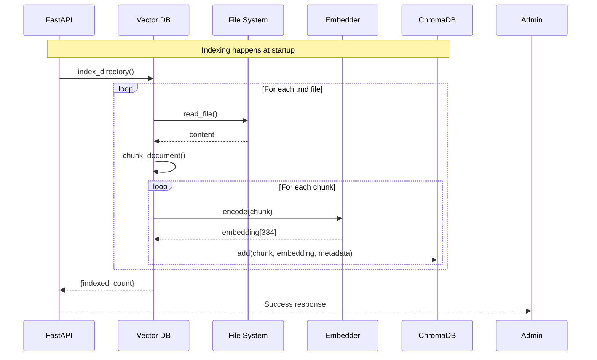
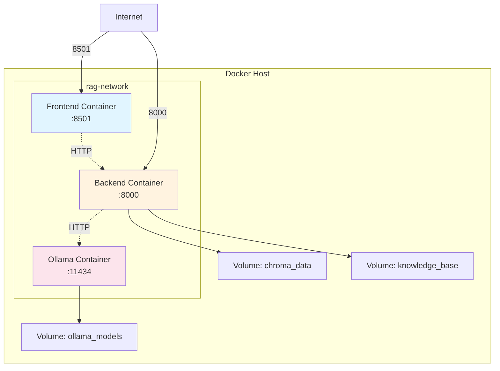

# Architecture Overview

This document provides a comprehensive overview of the Basecamp Handbook RAG API architecture.

## System Architecture



## Design Principles

### 1. **Separation of Concerns**

Each layer has a distinct responsibility:

- **Presentation**: User interaction (Streamlit)
- **API**: Request handling and routing (FastAPI)
- **Service**: Business logic (RAG Pipeline)
- **Data**: Persistence and models (ChromaDB, Ollama)

### 2. **Modularity**

Components are loosely coupled and independently testable:

```python
# Each service is independent
vector_db = VectorDBService()
llm_service = LLMService()
rag_pipeline = RAGPipeline(vector_db, llm_service)
```

### 3. **Asynchronous Processing**

FastAPI endpoints use async/await for non-blocking I/O:

```python
@router.post("/ask/stream")
async def ask_stream(request: QuestionRequest):
    async for chunk in rag_pipeline.answer_question_stream(request.question):
        yield chunk
```

### 4. **Configuration-Driven**

All settings externalized via environment variables:

```python
class Settings(BaseSettings):
    ollama_base_url: str = "http://localhost:11434"
    ollama_model: str = "llama3.2:3b"
    # ... more settings
```

### 5. **Local-First**

No external API dependencies:
- LLM runs locally (Ollama)
- Vector DB is embedded (ChromaDB)
- No API keys required

## Component Details

### Frontend (Streamlit)

**Purpose**: User interface for querying the knowledge base

**Key Features**:
- Real-time streaming responses
- Health monitoring
- Prompt type selection
- Source attribution display

**Technology**: Streamlit 1.31.0

**Location**: [frontend/app.py](../frontend/app.py)

### Backend API (FastAPI)

**Purpose**: RESTful API for RAG operations

**Key Features**:
- OpenAPI documentation
- Async request handling
- Health checks

**Technology**: FastAPI 0.109.0

**Location**: [backend/main.py](../backend/main.py)

### RAG Pipeline

**Purpose**: Orchestrates retrieval and generation

**Flow**:
1. Receive question
2. Embed question (sentence-transformers)
3. Search vector DB (ChromaDB)
4. Build prompt with context
5. Generate answer (Ollama)
6. Return answer with sources

**Location**: [backend/app/services/rag_pipeline.py](../backend/app/services/rag_pipeline.py)

### Vector DB Service

**Purpose**: Document indexing and semantic search

**Operations**:
- **Index**: Chunk and embed documents
- **Search**: Find relevant passages
- **Reset**: Clear and rebuild index

**Chunking Strategy**:
```python
# Header-based splitting
MarkdownHeaderTextSplitter(
    headers_to_split_on=[
        ("#", "Header 1"),
        ("##", "Header 2"),
        ("###", "Header 3"),
    ]
)

# Recursive text splitting
RecursiveCharacterTextSplitter(
    chunk_size=800,
    chunk_overlap=200
)
```

**Location**: [backend/app/services/vector_db.py](../backend/app/services/vector_db.py)

### LLM Service

**Purpose**: Answer generation using Ollama

**Features**:
- Synchronous generation
- Token streaming
- Prompt template management
- Temperature control

**Location**: [backend/app/services/llm_service.py](../backend/app/services/llm_service.py)

### Prompt Manager

**Purpose**: Centralized prompt template management

**Templates** (YAML):
```yaml
system_prompts:
  default: "You are an AI assistant..."
  friendly: "You are a helpful colleague..."
  concise: "Provide brief, direct answers..."

rag_templates:
  with_context: "Context:\n{context}\n\nQuestion: {question}"
  no_context: "I couldn't find information..."
```

**Location**: [backend/app/core/prompt_manager.py](../backend/app/core/prompt_manager.py)

## Data Flow

### Question Answering Flow



### Indexing Flow



## Deployment Architecture



### Container Details

| Container | Base Image | Purpose | Exposed Port |
|-----------|------------|---------|--------------|
| **Frontend** | python:3.11-slim | Streamlit UI | 8501 |
| **Backend** | python:3.11-slim | FastAPI server | 8000 |
| **Ollama** | ollama/ollama:latest | LLM inference | 11434 |

### Volumes

- **chroma_data**: Persists vector database
- **knowledge_base**: Mounts document directory
- **ollama_models**: Caches downloaded models

## Security Considerations

### Current Implementation

✅ **Implemented**:
- Local-only operation (no external APIs)
- Input validation (Pydantic)
- Logging without sensitive data

⚠️ **Development Mode**:
- No authentication
- No rate limiting
- Debug mode enabled

### Production Recommendations

For production deployment:

1. **Add Authentication**: JWT tokens or OAuth2
2. **Rate Limiting**: Prevent abuse
3. **HTTPS**: TLS/SSL certificates
4. **Monitoring**: Prometheus + Grafana
5. **Secrets Management**: Vault or AWS Secrets Manager

## Performance Characteristics

### Latency Breakdown

| Operation | Typical Latency | Notes |
|-----------|----------------|-------|
| **Embedding** | 10-50ms | Depends on query length |
| **Vector Search** | 5-20ms | Fast with ChromaDB |
| **LLM Generation** | 2-10s | Depends on answer length |
| **Total (Non-streaming)** | 2-15s | End-to-end |

### Scalability

**Current Limits**:
- Single-threaded LLM inference
- In-memory vector DB
- No load balancing

**Scaling Options**:
1. **Horizontal**: Multiple backend replicas + load balancer
2. **Vertical**: More GPU memory for larger models
3. **Caching**: Redis for frequent queries
4. **Batch Processing**: Queue system for async requests

## Technology Choices

### Why Ollama?

✅ **Pros**:
- Local execution (privacy)
- No API costs
- Fast inference with GPU
- Easy model switching

❌ **Cons**:
- Requires local resources
- Limited by hardware

### Why ChromaDB?

✅ **Pros**:
- Embedded (no separate server)
- Fast similarity search
- Easy persistence
- Good Python integration

❌ **Cons**:
- Not distributed
- Limited to ~10M vectors

### Why FastAPI?

✅ **Pros**:
- Async support
- Auto-generated docs
- Type safety (Pydantic)
- Modern Python

## Extension Points

### Adding New Endpoints

```python
# backend/app/api/endpoints/analytics.py
from fastapi import APIRouter

router = APIRouter()

@router.get("/analytics/popular")
async def get_popular_questions():
    # Implementation
    pass
```

### Custom Prompt Templates

```yaml
# backend/app/core/prompts.yaml
system_prompts:
  technical:
    content: "You are a technical documentation expert..."
```

### Alternative Embedding Models

```python
# backend/app/services/vector_db.py
from sentence_transformers import SentenceTransformer

model = SentenceTransformer('paraphrase-multilingual-MiniLM-L12-v2')
```

## Next Steps

- [Component Details](components.md) - Deep dive into each component
- [Data Flow](data-flow.md) - Detailed sequence diagrams
- [API Reference](../api/endpoints.md) - Complete API documentation

---

**Note**: This architecture is designed for local development and small-scale deployment. For production use cases with high traffic, consider additional components like load balancers, caching layers, and monitoring systems.
