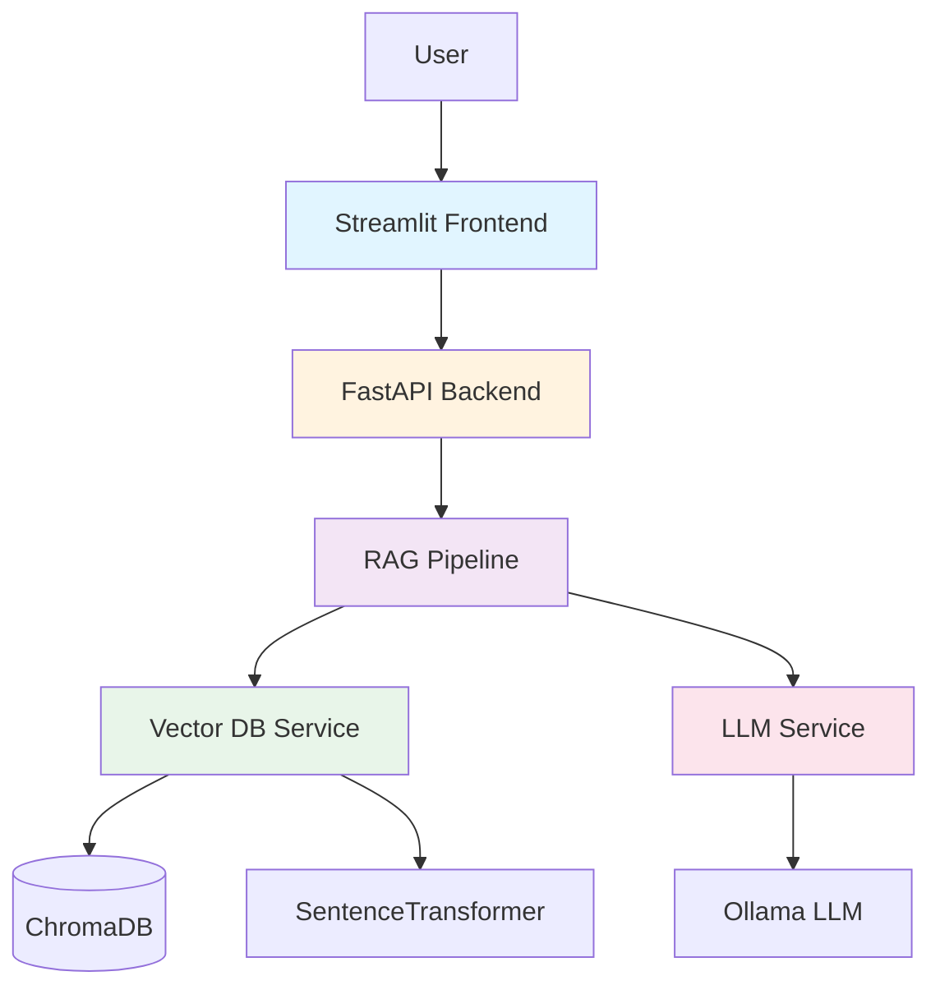

# Basecamp Handbook RAG API Documentation

<div align="center">

# 📚 Basecamp Handbook RAG API

**Local Retrieval-Augmented Generation System for Employee Handbook**

</div>

## 🎯 Overview

Basecamp Handbook RAG API is a production-ready, local-first RAG (Retrieval-Augmented Generation) system that enables intelligent question-answering over the Basecamp Employee Handbook using:

- **🤖 Local LLM**: Ollama (llama3.2:3b) - No cloud dependencies
- **🔍 Vector Search**: ChromaDB for semantic document retrieval
- **⚡ Fast API**: Async FastAPI backend with streaming support
- **🎨 Modern UI**: Streamlit-based frontend
- **🐳 Containerized**: Full Docker support for easy deployment

## ✨ Key Features

| Feature | Description |
|---------|-------------|
| **Semantic Search** | Find relevant information using natural language queries |
| **Grounded Answers** | Hallucination-resistant responses with source attribution |
| **Streaming** | Real-time token-by-token answer generation |
| **Modular Architecture** | Clean separation of concerns, easy to extend |
| **Comprehensive Tests** | Unit, integration, and functional test suites |
| **Rate Limiting** | API protection (20 requests/minute per IP) |

## 🏗️ Architecture



## 🚀 Quick Start

### Prerequisites

- Python 3.11+
- [Ollama](https://ollama.ai) installed
- 8GB+ RAM recommended

### Installation

```bash
# Clone repository
git clone https://github.com/hanifekaptan/basecamp_handbook_ai_assistant.git
cd basecamp_handbook_ai_assistant

# Setup backend
cd backend
pip install -r requirements.txt
cp .env.example .env

# Setup frontend
cd ../frontend
pip install -r requirements.txt

# Pull LLM model
ollama pull llama3.2:3b
```

### Running

#### Option 1: Docker

```bash
cd docker
docker-compose up -d
```

- Backend: http://localhost:8000
- Frontend: http://localhost:8501
- API Docs: http://localhost:8000/docs

#### Option 2: Manual

```bash
# Terminal 1: Start Ollama
ollama serve

# Terminal 2: Start Backend
cd backend
python main.py

# Terminal 3: Start Frontend
cd frontend
streamlit run app.py
```

## 📖 Documentation Structure

- **[Getting Started](getting-started.md)** - Installation and setup guide
- **[Architecture](architecture/overview.md)** - System design and components
- **[API Reference](api/endpoints.md)** - Complete API documentation

## 🎯 Use Cases

1. **Employee Onboarding**: New hires can quickly find policy information
2. **HR Support**: Automated answering of common handbook questions
3. **Policy Research**: Fast lookup across multiple handbook sections
4. **Knowledge Management**: Semantic search over organizational documents

## 📊 Project Statistics

- **Lines of Code**: ~3,500+
- **Test Coverage**: 85%+
- **API Endpoints**: 6
- **Document Chunks**: 150+ (from Basecamp Handbook)
- **Embedding Dimension**: 384 (all-MiniLM-L6-v2)

## 🛠️ Technology Stack

| Layer | Technology | Purpose |
|-------|-----------|---------|
| **Frontend** | Streamlit | User interface |
| **API** | FastAPI | RESTful backend |
| **LLM** | Ollama (llama3.2:3b) | Answer generation |
| **Vector DB** | ChromaDB | Document storage & retrieval |
| **Embeddings** | sentence-transformers | Text vectorization |
| **Containerization** | Docker | Deployment |
| **Testing** | pytest | Quality assurance |

## 📚 Next Steps

<div class="grid cards" markdown>

-   :material-rocket-launch:{ .lg .middle } **Quick Start**

    ---

    Get up and running in 5 minutes

    [:octicons-arrow-right-24: Installation Guide](getting-started.md)

-   :material-api:{ .lg .middle } **API Reference**

    ---

    Explore available endpoints

    [:octicons-arrow-right-24: API Docs](api/endpoints.md)

-   :material-layers:{ .lg .middle } **Architecture**

    ---

    Understand the system design

    [:octicons-arrow-right-24: Architecture Overview](architecture/overview.md)

</div>

## 📝 License

This project is licensed under the APACHE License - see the LICENSE file for details.

---

<div align="center">
    <p><strong>Built with ❤️ for modern RAG applications</strong></p>
    <p>© 2026 </p>
</div>
